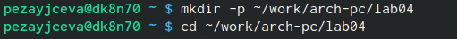
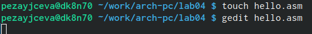
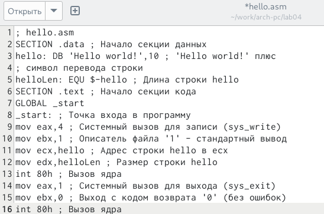
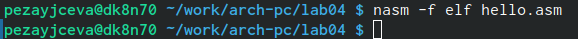
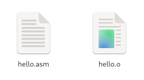
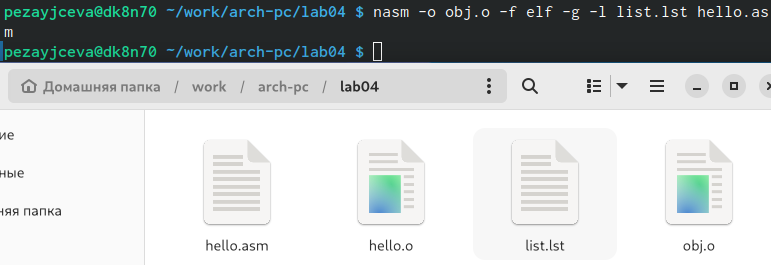
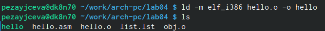
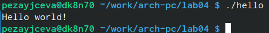
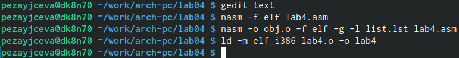

---
## Front matter
title: "Отчёта по лабораторной работе №4"
subtitle: "Создание и процесс
обработки программ на языке ассемблера NASM"
author: "Зайцева Пелагея Евгеньевна"

## Generic otions
lang: ru-RU
toc-title: "Содержание"

## Bibliography
bibliography: bib/cite.bib
csl: pandoc/csl/gost-r-7-0-5-2008-numeric.csl

## Pdf output format
toc: true # Table of contents
toc-depth: 2
lof: true # List of figures
lot: true # List of tables
fontsize: 12pt
linestretch: 1.5
papersize: a4
documentclass: scrreprt
## I18n polyglossia
polyglossia-lang:
  name: russian
  options:
	- spelling=modern
	- babelshorthands=true
polyglossia-otherlangs:
  name: english
## I18n babel
babel-lang: russian
babel-otherlangs: english
## Fonts
mainfont: PT Serif
romanfont: PT Serif
sansfont: PT Sans
monofont: PT Mono
mainfontoptions: Ligatures=TeX
romanfontoptions: Ligatures=TeX
sansfontoptions: Ligatures=TeX,Scale=MatchLowercase
monofontoptions: Scale=MatchLowercase,Scale=0.9
## Biblatex
biblatex: true
biblio-style: "gost-numeric"
biblatexoptions:
  - parentracker=true
  - backend=biber
  - hyperref=auto
  - language=auto
  - autolang=other*
  - citestyle=gost-numeric
## Pandoc-crossref LaTeX customization
figureTitle: "Рис."
tableTitle: "Таблица"
listingTitle: "Листинг"
lofTitle: "Список иллюстраций"
lotTitle: "Список таблиц"
lolTitle: "Листинги"
## Misc options
indent: true
header-includes:
  - \usepackage{indentfirst}
  - \usepackage{float} # keep figures where there are in the text
  - \floatplacement{figure}{H} # keep figures where there are in the text
---

# Цель работы

Освоение процедуры компиляции и сборки программ, написанных на ассемблере NASM.
# Задание
Создание отчета.

# Теоретическое введение
Основные принципы работы компьютера.
Ассемблер и язык ассемблера. Язык ассемблера (assembly language, сокращённо asm) — машинно-ориентированный язык низкого уровня.
Процесс создания и обработки программы на языке ассемблера.

# Выполнение лабораторной работы
1.1 Создала каталог для работы с программами на языке ассемблера NASM и перешла в созданный каталог.
{#fig:001 width=70%}
1.2 Создала текстовый файл с именем hello.asm и открыла этот файл с помощью текстового редактора gedit
{#fig:002 width=70%}
1.3 Ввела в него следующий текст:
{#fig:003 width=70%}
2.1 Для компиляции приведённого выше текста программы «Hello World» задала команду.
{#fig:004 width=70%}
2.2 Транслятор преобразовал текст программы из файла hello.asm в объектный код, который запишется в файл hello.o.
{#fig:005 width=70%}
3.1 Выполнила следующую команду: (Данная команда скомпилирует исходный файл hello.asm в obj.o)
{#fig:006 width=70%}
3.2 С помощью команды ls проверила, что файлы были созданы.
4.1 Объектный файл передала на обработку компоновщику и помощью команды ls провериоа, что исполняемый файл hello был создан.
{#fig:007 width=70%}
4.2 Запустила на выполнение созданный исполняемый файл, находящийся в текущем каталоге.
{#fig:008 width=70%}

ДЛЯ САМОСТОЯТЕЛЬНОЙ РАБОТЫ.
5.1 В каталоге ~/work/arch-pc/lab04 с помощью команды cp создала копию файла
hello.asm с именем lab4.asm
5.2 С помощью текстового редактора внесла изменения в текст программы в
файле lab4.asm так, чтобы вместо Hello world! на экран выводилась строка с моей
фамилией и именем.
{#fig:009 width=70%}
5.3 Оттранслировала полученный текст программы lab4.asm в объектный файл и выполнила
компоновку объектного файла, запустила получившийся исполняемый файл.
5.4 Загрузила файлы на Github.
# Выводы
Освоила процедуры компиляции и сборки программ, написанных на ассемблере NASM.
# Список литературы{.unnumbered}

