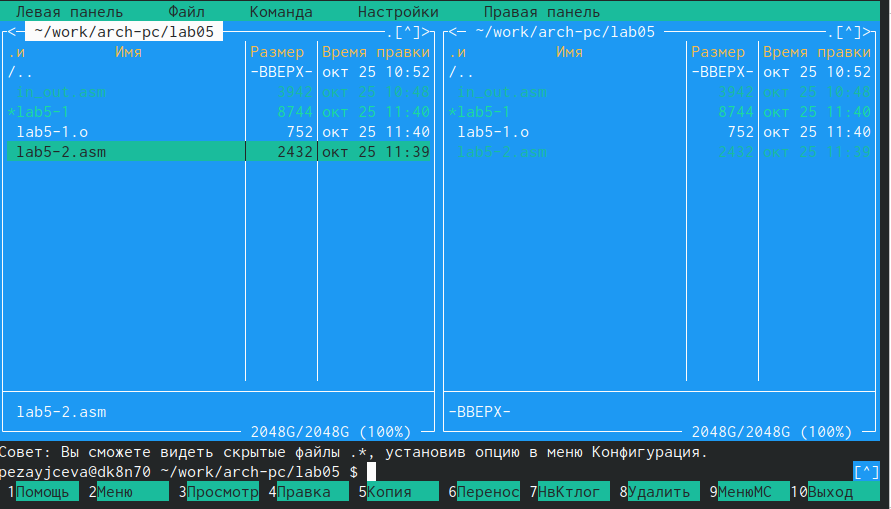

---
## Front matter
title: " Лабораторная работа №5. "
subtitle: "Основы работы с
Midnight Commander (mc). Структура программы на
языке ассемблера NASM. Системные вызовы в ОС
GNU Linux"
author: "Зайцева П.Е."

## Generic otions
lang: ru-RU
toc-title: "Содержание"

## Bibliography
bibliography: bib/cite.bib
csl: pandoc/csl/gost-r-7-0-5-2008-numeric.csl

## Pdf output format
toc: true # Table of contents
toc-depth: 2
lof: true # List of figures
lot: true # List of tables
fontsize: 12pt
linestretch: 1.5
papersize: a4
documentclass: scrreprt
## I18n polyglossia
polyglossia-lang:
  name: russian
  options:
	- spelling=modern
	- babelshorthands=true
polyglossia-otherlangs:
  name: english
## I18n babel
babel-lang: russian
babel-otherlangs: english
## Fonts
mainfont: PT Serif
romanfont: PT Serif
sansfont: PT Sans
monofont: PT Mono
mainfontoptions: Ligatures=TeX
romanfontoptions: Ligatures=TeX
sansfontoptions: Ligatures=TeX,Scale=MatchLowercase
monofontoptions: Scale=MatchLowercase,Scale=0.9
## Biblatex
biblatex: true
biblio-style: "gost-numeric"
biblatexoptions:
  - parentracker=true
  - backend=biber
  - hyperref=auto
  - language=auto
  - autolang=other*
  - citestyle=gost-numeric
## Pandoc-crossref LaTeX customization
figureTitle: "Рис."
tableTitle: "Таблица"
listingTitle: "Листинг"
lofTitle: "Список иллюстраций"
lotTitle: "Список таблиц"
lolTitle: "Листинги"
## Misc options
indent: true
header-includes:
  - \usepackage{indentfirst}
  - \usepackage{float} # keep figures where there are in the text
  - \floatplacement{figure}{H} # keep figures where there are in the text
---

# Цель работы

Приобрести практические навыки работы в Midnight Commander. Освоить инструкции
языка ассемблера mov и int

# Задание

Здесь приводится описание задания в соответствии с рекомендациями
методического пособия и выданным вариантом.

# Теоретическое введение

Midnight Commander (или просто mc) — это программа, которая позволяет просматривать
структуру каталогов и выполнять основные операции по управлению файловой системой,
т.е. mc является файловым менеджером. Midnight Commander позволяет сделать работу с
файлами более удобной и наглядной.

# Выполнение лабораторной работы

1.1 Открыла Midnight Commander и перешла в каталог ~/work/arch-pc , созданный
при выполнении лабораторной работы №4.

1.2 Создала  папку lab05, перешла в созданный каталог.

1.3 Пользуясь строкой ввода и командой touch создала файл lab5-1.asm
{#fig:001 width=70%}

1.4 Открыла файл lab5-1.asm для редактирования во встроенном редакторе и ввела текст программы.

{#fig:002 width=70%}

1.5 Убедилась, что файл содержит текст программы.

{#fig:003 width=70%}

1.6  Оттранслировала текст программы lab5-1.asm в объектный файл. Выполнила компо-
новку объектного файла и запустила получившийся исполняемый файл. 

{#fig:004 width=70%}

2.1 Скачала файл in_out.asm со страницы курса в ТУИС.

2.2 Создала копию файла lab5-1.asm с именем lab5-2.asm. 

{#fig:005 width=70%}

2.3 Исправила  текст программы в файле lab5-2.asm с использование подпрограмм из внешнего файла in_out.asm 

{#fig:006 width=70%}

{#fig:007 width=70%}

{#fig:008 width=70%}

3.1 Создала копию файла lab5-1.asm с назваием lab5-1.1asm и внесите изменения в программу (без использования внешнего файла in_out.asm)

{#fig:009 width=70%}

3.2 Создала копию файла lab5-2.asm с названием lab5-4.asm и исправила текст программы с использование подпрограмм из внешнего файла in_out.asm.

{#fig:0010 width=70%}

3.3 Создала исполняемый файл и проверила его работу.

{#fig:0011 width=70%}

# Выводы

Я приобрела практические навыки работы в Midnight Commander и освоила инструкции
языка ассемблера mov и int.

# Список литературы{.unnumbered}

::: {#refs}
:::
