---
## Front matter
title: "Отчет по лабораторной работе №6."
subtitle: "Арифметические операции в NASM"
author: "Зайцева П. Е."

## Generic otions
lang: ru-RU
toc-title: "Содержание"

## Bibliography
bibliography: bib/cite.bib
csl: pandoc/csl/gost-r-7-0-5-2008-numeric.csl

## Pdf output format
toc: true # Table of contents
toc-depth: 2
lof: true # List of figures
lot: true # List of tables
fontsize: 12pt
linestretch: 1.5
papersize: a4
documentclass: scrreprt
## I18n polyglossia
polyglossia-lang:
  name: russian
  options:
	- spelling=modern
	- babelshorthands=true
polyglossia-otherlangs:
  name: english
## I18n babel
babel-lang: russian
babel-otherlangs: english
## Fonts
mainfont: PT Serif
romanfont: PT Serif
sansfont: PT Sans
monofont: PT Mono
mainfontoptions: Ligatures=TeX
romanfontoptions: Ligatures=TeX
sansfontoptions: Ligatures=TeX,Scale=MatchLowercase
monofontoptions: Scale=MatchLowercase,Scale=0.9
## Biblatex
biblatex: true
biblio-style: "gost-numeric"
biblatexoptions:
  - parentracker=true
  - backend=biber
  - hyperref=auto
  - language=auto
  - autolang=other*
  - citestyle=gost-numeric
## Pandoc-crossref LaTeX customization
figureTitle: "Рис."
tableTitle: "Таблица"
listingTitle: "Листинг"
lofTitle: "Список иллюстраций"
lotTitle: "Список таблиц"
lolTitle: "Листинги"
## Misc options
indent: true
header-includes:
  - \usepackage{indentfirst}
  - \usepackage{float} # keep figures where there are in the text
  - \floatplacement{figure}{H} # keep figures where there are in the text
---

# Цель работы

Освоение арифметических инструкций языка ассемблера NASM.

# Теоретическое введение

Существует три основных способа адресации:
• Регистровая адресация – операнды хранятся в регистрах и в команде используются
имена этих регистров, например: mov ax,bx.
• Непосредственная адресация – значение операнда задается непосредственно в ко-
манде, Например: mov ax,2.
• Адресация памяти – операнд задает адрес в памяти. В команде указывается символи-
ческое обозначение ячейки памяти, над содержимым которой требуется выполнить
операцию.

# Выполнение лабораторной работы

Создала каталог для программ по лабораторных работ №6, перешла в него и создала файл lab6-1.asm

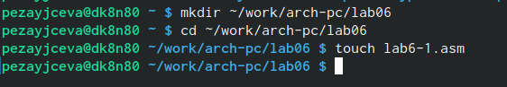{#fig:001 width=70%}

Ввела в файл lab6-1.asm текст программы из листинга 6.1.
Далее создала исполняемый файл и запустила его.

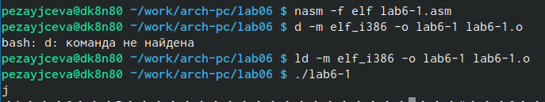{#fig:002 width=70%}

В данном случае при выводе значения регистра eax мы ожидаем увидеть число 10. Однако
результатом будет символ j. 

После изменила текст программы и вместо символов, записала в регистры числа. 

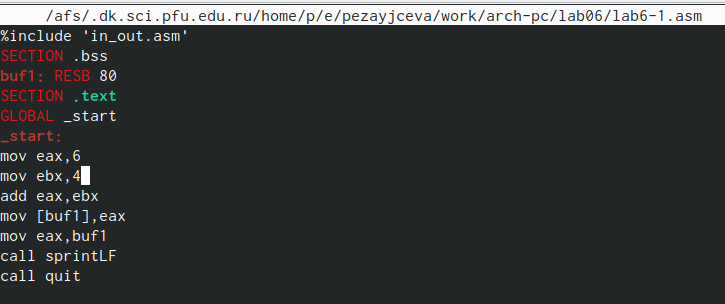{#fig:003 width=70%}

Создала исполняемый файл и запустила его.

Создала файл lab6-2.asm в каталоге ~/work/arch-pc/lab06 .

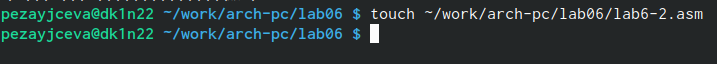{#fig:005 width=70%}

Ввела в него текст программы из листинга 6.2.

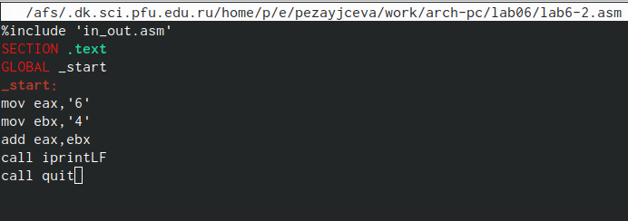{#fig:006 width=70%}

Создала исполняемый файл и запустила его.

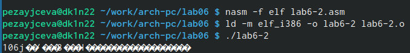{#fig:007 width=70%}

В результате работы программы получила число 106.

Аналогично предыдущему примеру изменила символы на числа.

Создала исполняемый файл и запустила его. Результат 10.

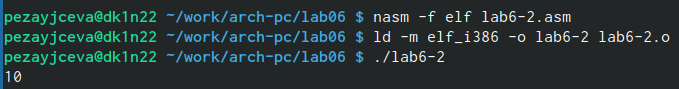{#fig:008 width=70%}

Создала файл lab6-3.asm в каталоге ~/work/arch-pc/lab06 

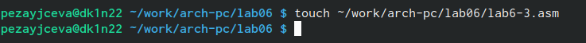{#fig:009 width=70%}

Из листинга 6.3 ввела текст в lab6-3.asm

Создала исполняемый файл и запустила его.

Далее изменила текст программы под выражение 𝑓(𝑥) = (4 ∗ 6 + 2)/5 и заупстила.

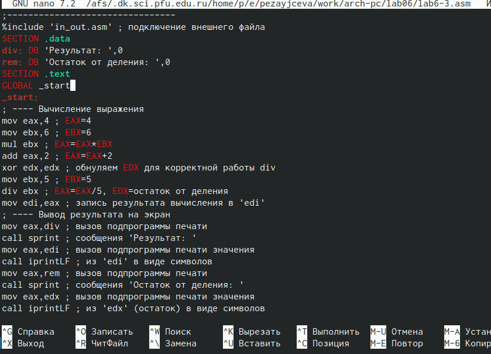{#fig:0010 width=70%}

Создала файл variant.asm в каталоге ~/work/arch-pc/lab06

Запустила файл и получила свой номер варианта.

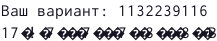{#fig:0015 width=70%}

   1. За вывод сообщения "Ваш вариант" отвечают строки кода:

mov eax,rem
call sprint

   2. Инструкция mov ecx, x используется, чтобы положить адрес вводимой строки x в регистр ecx mov edx, 80 - запись в регистр edx длины вводимой строки call sread - вызов подпрограммы из внешнего файла, обеспечивающей ввод сообщения с клавиатуры

   3. call atoi используется для вызова подпрограммы из внешнего файла, которая преобразует ascii-код символа в целое число и записывает результат в регистр eax

   4. За вычисления варианта отвечают строки:

xor edx,edx ; обнуление edx для корректной работы div
mov ebx,20 ; ebx = 20
div ebx ; eax = eax/20, edx - остаток от деления
inc edx ; edx = edx + 1

   5. При выполнении инструкции div ebx остаток от деления записывается в регистр edx

   6. Инструкция inc edx увеличивает значение регистра edx на 1

   7. За вывод на экран результатов вычислений отвечают строки:

mov eax,edx
call iprintLF

Написать программу вычисления выражения 18(𝑥 + 1)/6 

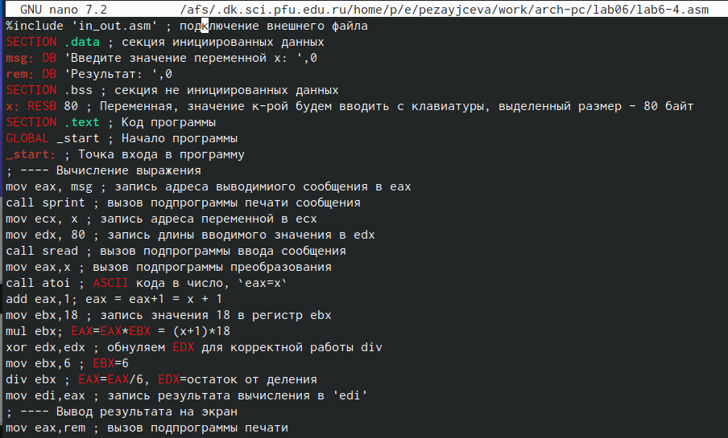{#fig:0012 width=70%}

Вывод при х=3

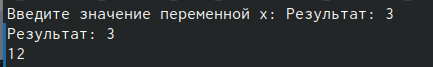{#fig:0013 width=70%}

Вывод при х=1

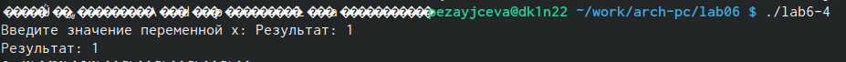{#fig:0014 width=70%}

# Выводы

Освоила арифметические инструкции языка ассемблера NASM.

# Список литературы{.unnumbered}

::: {#refs}
:::
