---
## Front matter
title: "Отчет по лабораторной работе No7"
subtitle: " Команды безусловного и условного переходов в Nasm. Программирование ветвлений."
author: "Зайцева П. Е."

## Generic otions
lang: ru-RU
toc-title: "Содержание"

## Bibliography
bibliography: bib/cite.bib
csl: pandoc/csl/gost-r-7-0-5-2008-numeric.csl

## Pdf output format
toc: true # Table of contents
toc-depth: 2
lof: true # List of figures
lot: true # List of tables
fontsize: 12pt
linestretch: 1.5
papersize: a4
documentclass: scrreprt
## I18n polyglossia
polyglossia-lang:
  name: russian
  options:
	- spelling=modern
	- babelshorthands=true
polyglossia-otherlangs:
  name: english
## I18n babel
babel-lang: russian
babel-otherlangs: english
## Fonts
mainfont: PT Serif
romanfont: PT Serif
sansfont: PT Sans
monofont: PT Mono
mainfontoptions: Ligatures=TeX
romanfontoptions: Ligatures=TeX
sansfontoptions: Ligatures=TeX,Scale=MatchLowercase
monofontoptions: Scale=MatchLowercase,Scale=0.9
## Biblatex
biblatex: true
biblio-style: "gost-numeric"
biblatexoptions:
  - parentracker=true
  - backend=biber
  - hyperref=auto
  - language=auto
  - autolang=other*
  - citestyle=gost-numeric
## Pandoc-crossref LaTeX customization
figureTitle: "Рис."
tableTitle: "Таблица"
listingTitle: "Листинг"
lofTitle: "Список иллюстраций"
lotTitle: "Список таблиц"
lolTitle: "Листинги"
## Misc options
indent: true
header-includes:
  - \usepackage{indentfirst}
  - \usepackage{float} # keep figures where there are in the text
  - \floatplacement{figure}{H} # keep figures where there are in the text
---

# Цель работы
Изучение команд условного и безусловного переходов. Приобретение навыков написания
программ с использованием переходов. Знакомство с назначением и структурой файла
листинга.

# Теоретическое введение

Для реализации ветвлений в ассемблере используются так называемые команды передачи
управления или команды перехода. Можно выделить 2 типа переходов:

• условный переход – выполнение или не выполнение перехода в определенную точку
программы в зависимости от проверки условия.

• безусловный переход – выполнение передачи управления в определенную точку про-
граммы без каких-либо условий

Флаг – это бит, принимающий значение 1 («флаг установлен»), если выполнено некоторое
условие, и значение 0 («флаг сброшен») в противном случае. Флаги работают независимо
друг от друга, и лишь для удобства они помещены в единый регистр — регистр флагов, отра-
жающий текущее состояние процессора.

Листинг (в рамках понятийного аппарата NASM) — это один из выходных файлов, созда-
ваемых транслятором. Он имеет текстовый вид и нужен при отладке программы, так как
кроме строк самой программы он содержит дополнительную информацию.

Все ошибки и предупреждения, обнаруженные при ассемблировании, транслятор выводит
на экран, и файл листинга не создаётся.
Итак, структура листинга:

• номер строки — это номер строки файла листинга (нужно помнить, что номер строки в
файле листинга может не соответствовать номеру строки в файле с исходным текстом
программы);

• адрес — это смещение машинного кода от начала текущего сегмента;

• машинный код представляет собой ассемблированную исходную строку в виде шестна-
дцатеричной последовательности. (например, инструкция int 80h начинается по сме-
щению 00000020 в сегменте кода; далее идёт машинный код, в который ассемблируется
инструкция, то есть инструкция int 80h ассемблируется в CD80 (в шестнадцатеричном
представлении); CD80 — это инструкция на машинном языке, вызывающая прерывание
ядра);

• исходный текст программы — это просто строка исходной программы вместе с ком-
ментариями (некоторые строки на языке ассемблера, например, строки, содержащие
только комментарии, не генерируют никакого машинного кода, и поля «смещение» и
«исходный текст программы» в таких строках отсутствуют, однако номер строки им
присваивается).
# Выполнение лабораторной работы

Создала каталог для программам лабораторной работы No 7, перешла в него и со-
здала файл lab7-1.asm.

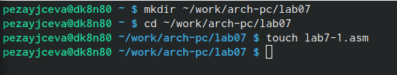{#fig:001 width=70%}

Ввела в файл lab7-1.asm текст программы из первого листинга.
Создала исполняемый файл и запустила его. 

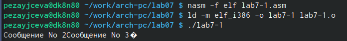{#fig:002 width=70%}

Изменила текст программы в соответствии со вторым листингом и получила слдующее:

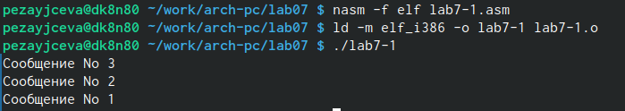{#fig:003 width=70%}

Создала файл lab7-2.asm в каталоге ~/work/arch-pc/lab07.
Изучила текст программы из третьего листинга и введите в lab7-2.asm.

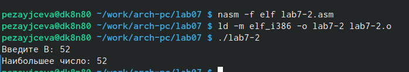{#fig:004 width=70%}

Открыла файл листинга lab7-2.lst с помощью любого текстового редактора.

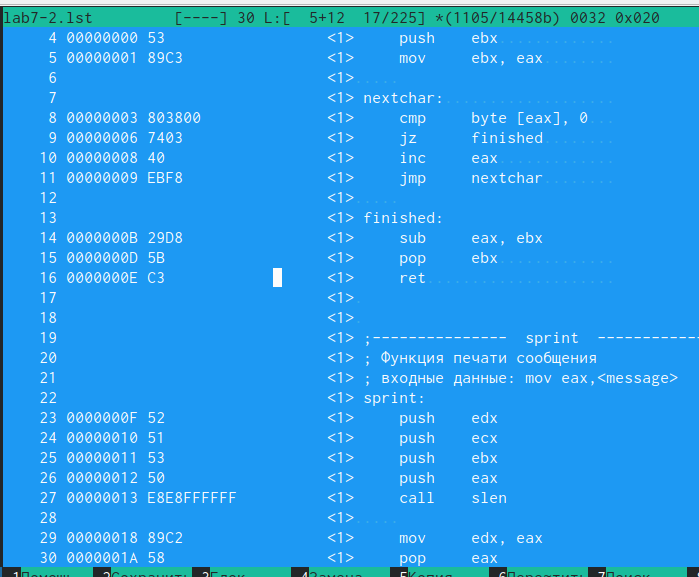{#fig:005 width=70%}

Открыла файл с программой lab7-2.asm и в инструкции с двумя операндами удалила один операнд. 

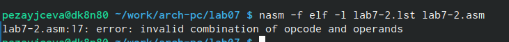{#fig:006 width=70%}

Задание из самостоятельной работы.

Создала файл lab07-3.asm и написала программу нахождения аименьшей из 3 целочисленных переменных 𝑎,𝑏 и c.

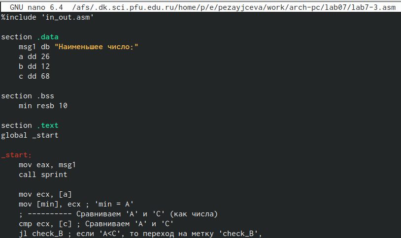{#fig:007 width=70%}

Вариант 17, значения 26,12,68.

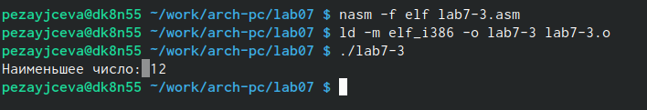{#fig:008 width=70%}

Создала файл lab07-4.asm и написала программу  которая для введенных с клавиатуры значений 𝑥 и 𝑎 вычисляет значение заданной функции 𝑓(𝑥) и выводит результат вычислений.
Вид функции вариант 17.

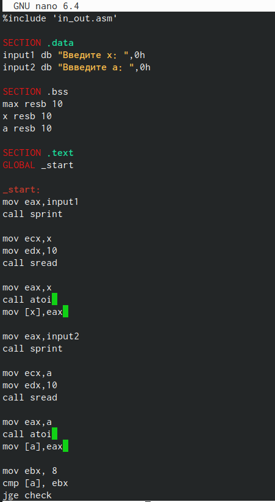{#fig:009 width=70%}

Создала исполняемый файл и проверила его работу для значений 𝑥 и 𝑎.

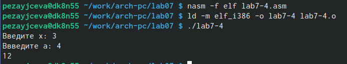{#fig:0010 width=70%}

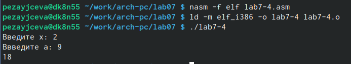{#fig:0011 width=70%}

# Выводы
Я изучила команды условного и безусловного переходов. Приобрела навыки написания
программ с использованием переходов.Ознакомилась с назначением и структурой файла
листинга.
# Список литературы{.unnumbered}

::: {#refs}
:::
