---
## Front matter
title: "Отчет по лабораторной работе 9"
subtitle: " Понятие подпрограммы.Отладчик GDB."
author: "Зайцева П.Е."

## Generic otions
lang: ru-RU
toc-title: "Содержание"

## Bibliography
bibliography: bib/cite.bib
csl: pandoc/csl/gost-r-7-0-5-2008-numeric.csl

## Pdf output format
toc: true # Table of contents
toc-depth: 2
lof: true # List of figures
lot: true # List of tables
fontsize: 12pt
linestretch: 1.5
papersize: a4
documentclass: scrreprt
## I18n polyglossia
polyglossia-lang:
  name: russian
  options:
	- spelling=modern
	- babelshorthands=true
polyglossia-otherlangs:
  name: english
## I18n babel
babel-lang: russian
babel-otherlangs: english
## Fonts
mainfont: PT Serif
romanfont: PT Serif
sansfont: PT Sans
monofont: PT Mono
mainfontoptions: Ligatures=TeX
romanfontoptions: Ligatures=TeX
sansfontoptions: Ligatures=TeX,Scale=MatchLowercase
monofontoptions: Scale=MatchLowercase,Scale=0.9
## Biblatex
biblatex: true
biblio-style: "gost-numeric"
biblatexoptions:
  - parentracker=true
  - backend=biber
  - hyperref=auto
  - language=auto
  - autolang=other*
  - citestyle=gost-numeric
## Pandoc-crossref LaTeX customization
figureTitle: "Рис."
tableTitle: "Таблица"
listingTitle: "Листинг"
lofTitle: "Список иллюстраций"
lotTitle: "Список таблиц"
lolTitle: "Листинги"
## Misc options
indent: true
header-includes:
  - \usepackage{indentfirst}
  - \usepackage{float} # keep figures where there are in the text
  - \floatplacement{figure}{H} # keep figures where there are in the text
---

# Цель работы

Приобретение навыков написания программ с использованием подпрограмм. 
Знакомство с методами отладки при помощи GDB и его основными возможностями.

# Теоретическое введение

Отладка — это процесс поиска и исправления ошибок в программе. В общем случае его можно разделить на четыре этапа:

• обнаружение ошибки;
• поиск её местонахождения;
• определение причины ошибки;
• исправление ошибки.

Можно выделить следующие типы ошибок:

• синтаксические ошибки — обнаруживаются во время трансляции исходного кода и
вызваны нарушением ожидаемой формы или структуры языка;
• семантические ошибки — являются логическими и приводят к тому, что программа
запускается, отрабатывает, но не даёт желаемого результата;
• ошибки в процессе выполнения — не обнаруживаются при трансляции и вызывают пре-
рывание выполнения программы (например, это ошибки, связанные с переполнением
или делением на ноль).

Второй этап — поиск местонахождения ошибки. Некоторые ошибки обнаружить доволь-
но трудно. Лучший способ найти место в программе, где находится ошибка, это разбить
программу на части и произвести их отладку отдельно друг от друга.

Третий этап — выяснение причины ошибки. После определения местонахождения ошибки
обычно проще определить причину неправильной работы программы.

Последний этап — исправление ошибки. После этого при повторном запуске программы,
может обнаружиться следующая ошибка, и процесс отладки начнётся заново.

Подпрограмма — это, как правило, функционально законченный участок кода, который
можно многократно вызывать из разных мест программы. В отличие от простых переходов
из подпрограмм существует возврат на команду, следующую за вызовом.

Если в программе встречается одинаковый участок кода, его можно оформить в виде
подпрограммы, а во всех нужных местах поставить её вызов. При этом подпрограмма бу-
дет содержаться в коде в одном экземпляре, что позволит уменьшить размер кода всей
программы.
# Выполнение лабораторной работы
Создала каталог для выполнения лабораторной работы No 9, перешла в него и создала файл lab09-1.asm

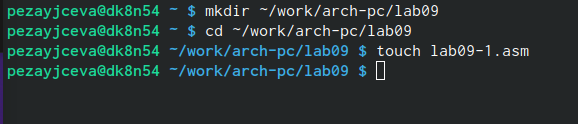{#fig:001 width=70%}

Ввела в файл lab09-1.asm текст программы из листинга 9.1. Создала исполняемый
файл и проверила его работу.

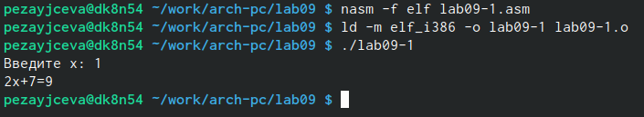{#fig:002 width=70%}

Создала файл lab09-2.asm с текстом программы из Листинга 9.2.
Получила исполняемый файл. Для работы с GDB в исполняемый файл добавила
отладочную информацию, для этого трансляцию программ провела с ключом
‘-g’.
Проверила работу программы, запустив ее в оболочке GDB с помощью команды run 

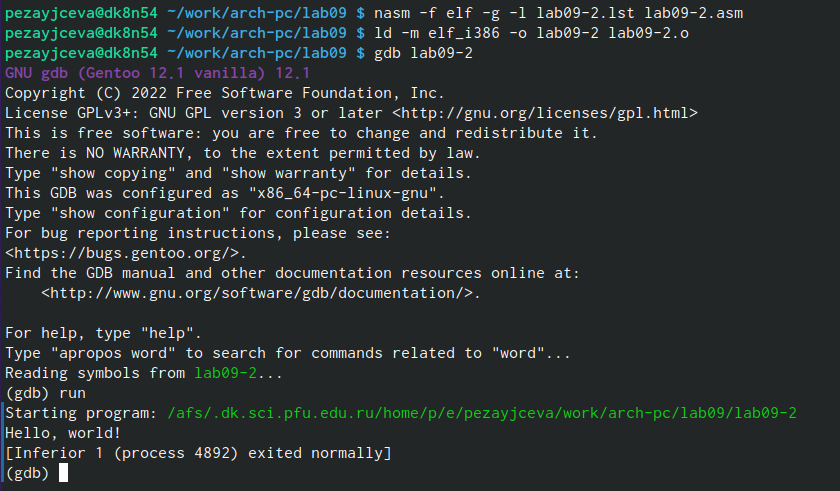{#fig:003 width=70%}

Включила режим псевдографики для более удобного анализа программы.
В этом режиме есть три окна:

• В верхней части видны названия регистров и их текущие значения;

• В средней части виден результат дисассимилирования программы;

• Нижняя часть доступна для ввода команд.

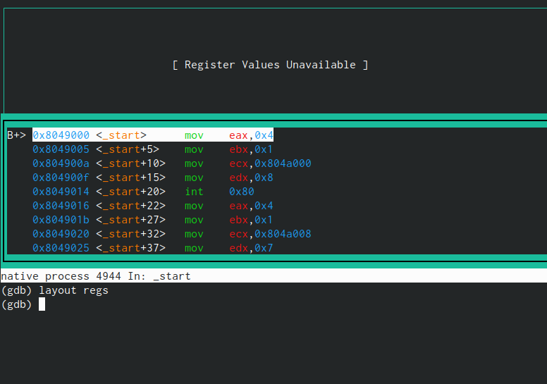{#fig:004 width=70%}

На предыдущих шагах была установлена точка останова по имени метки (_start). 
Проверила это с помощью команды info breakpoints.
Определила адрес предпоследней инструкции (mov ebx,0x0) и установила точку останова.

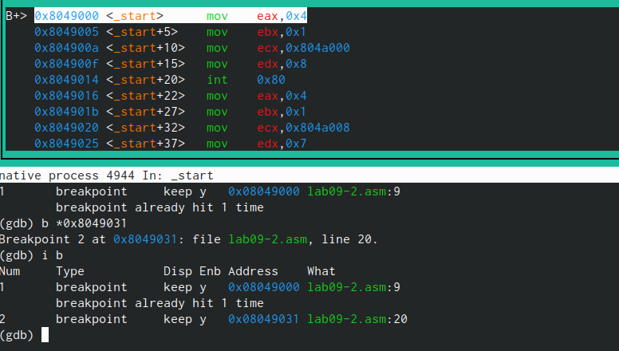{#fig:005 width=70%}

Посмотрела содержимое регистров также можно с помощью команды info registers
Посмотрела значение переменной msg2 по адресу.

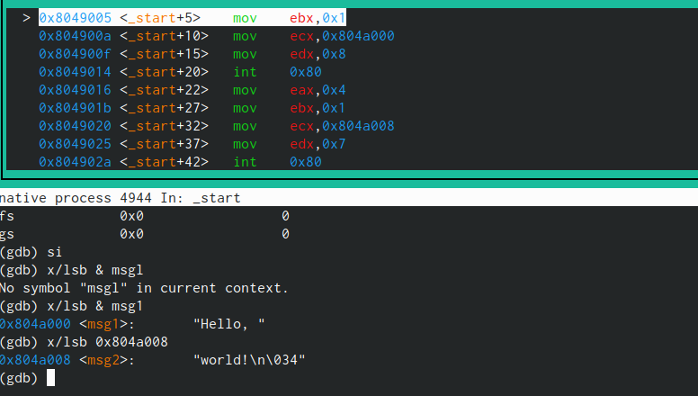{#fig:006 width=70%}

С помощью команды set измените значение регистра ebx.

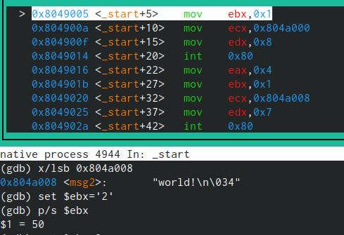{#fig:007 width=70%}

Скопировала файл lab8-2.asm, созданный при выполнении лабораторной работы No8,с программой выводящей на экран аргументы командной строки (Листинг 8.2) в файл с именем lab09-3.asm.
Создала исполняемый файл.

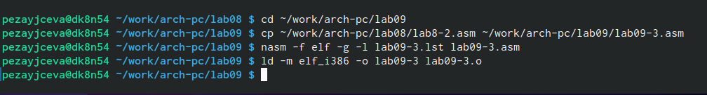{#fig:008 width=70%}

Для загрузки в gdb программы с аргументами необходимо использовать ключ --args.
Загрузила исполняемый файл в отладчик, указав аргументы.
Для начала установила точку останова перед первой инструкцией в программе и запустила ее.

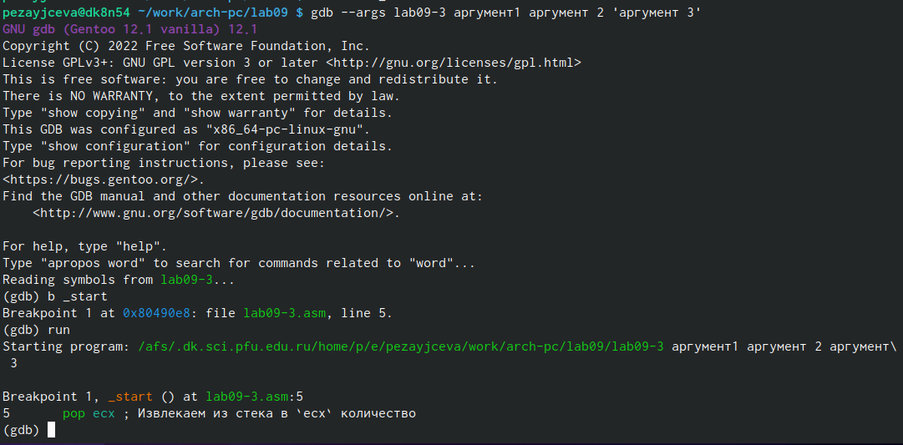{#fig:009 width=70%}

Посмотрела остальные позиции стека – по адесу [esp+4] располагается адрес в памяти
где находиться имя программы, по адесу [esp+8] храниться адрес первого аргумента, по
аресу [esp+12] – второго и т.д.

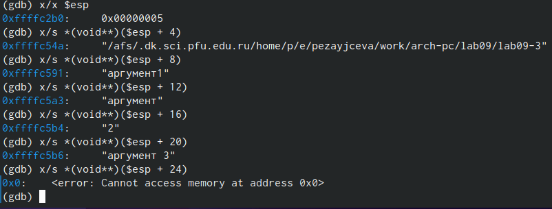{#fig:0010 width=70%}

Задание для самостоятельной работы.

Создала файл lab09-1.asm. Ввела программу из листинга 9.3. При запуске данная программа дает неверный результат. Проверила это. 

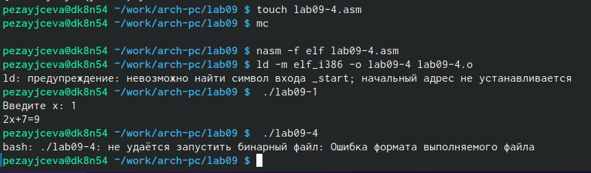{#fig:0011 width=70%}

С помощью отладчика GDB, анализируя изменения значений регистров, определила ошибку и исправьте ее.
Ошибка была в строках:
add ebx,eax
mov ecx,4
mul ecx
add ebx,5
mov edi,ebx

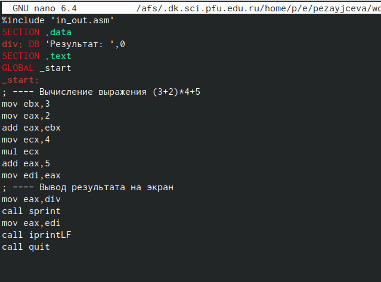{#fig:0012 width=70%}

Исправленный листинг:
%include 'in_out.asm'
SECTION .data
div: DB 'Результат: ',0
SECTION .text
GLOBAL _start
_start:
; ---- Вычисление выражения (3+2)*4+5
mov ebx,3
mov eax,2
add eax,ebx
mov ecx,4
mul ecx
add eax,5
mov edi,eax
; ---- Вывод результата на экран
mov eax,div
call sprint
mov eax,edi
call iprintLF
call quit

Проверила его работу.

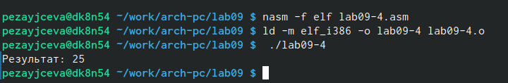{#fig:0013 width=70%}

# Выводы

Приобрела навыки написания программ с использованием подпрограмм. Ознакомилась с методами отладки при помощи GDB и его основными возможностями.

