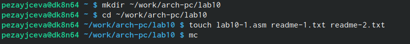
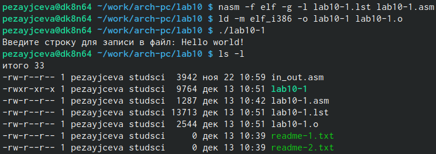
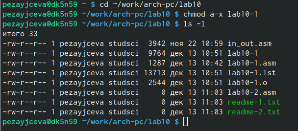
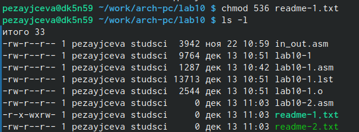
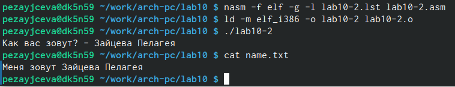
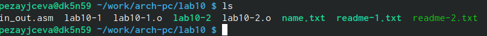

---
## Front matter
title: "Отчет по лабораторной работе No10."
subtitle: "Работа с файлами средствами Nasm"
author: "Зайцева П.Е."

## Generic otions
lang: ru-RU
toc-title: "Содержание"

## Bibliography
bibliography: bib/cite.bib
csl: pandoc/csl/gost-r-7-0-5-2008-numeric.csl

## Pdf output format
toc: true # Table of contents
toc-depth: 2
lof: true # List of figures
lot: true # List of tables
fontsize: 12pt
linestretch: 1.5
papersize: a4
documentclass: scrreprt
## I18n polyglossia
polyglossia-lang:
  name: russian
  options:
	- spelling=modern
	- babelshorthands=true
polyglossia-otherlangs:
  name: english
## I18n babel
babel-lang: russian
babel-otherlangs: english
## Fonts
mainfont: PT Serif
romanfont: PT Serif
sansfont: PT Sans
monofont: PT Mono
mainfontoptions: Ligatures=TeX
romanfontoptions: Ligatures=TeX
sansfontoptions: Ligatures=TeX,Scale=MatchLowercase
monofontoptions: Scale=MatchLowercase,Scale=0.9
## Biblatex
biblatex: true
biblio-style: "gost-numeric"
biblatexoptions:
  - parentracker=true
  - backend=biber
  - hyperref=auto
  - language=auto
  - autolang=other*
  - citestyle=gost-numeric
## Pandoc-crossref LaTeX customization
figureTitle: "Рис."
tableTitle: "Таблица"
listingTitle: "Листинг"
lofTitle: "Список иллюстраций"
lotTitle: "Список таблиц"
lolTitle: "Листинги"
## Misc options
indent: true
header-includes:
  - \usepackage{indentfirst}
  - \usepackage{float} # keep figures where there are in the text
  - \floatplacement{figure}{H} # keep figures where there are in the text
---

# Цель работы

Приобретение навыков написания программ для работы с файлами.

# Теоретическое введение

ОС GNU/Linux является многопользовательской операционной системой. И для обеспече-
ния защиты данных одного пользователя от действий других пользователей существуют
специальные механизмы разграничения доступа к файлам. Кроме ограничения доступа, дан-
ный механизм позволяет разрешить другим пользователям доступ данным для совместной
работы.
Права доступа определяют набор действий (чтение, запись, выполнение), разрешённых
для выполнения пользователям системы над файлами. Для каждого файла пользователь
может входить в одну из трех групп: владелец, член группы владельца, все остальные. 

# Выполнение лабораторной работы

Введем в файл lab10-1.asm текст программы из листинга 10.1, создадим исполняемый файл и проверим его работу:

{#fig:001 width=70%}

{#fig:002 width=70%}

С помощью команды chmod изменим права доступа к исполняемому файлу lab10-1, запретив его выполнение. Получим отказ в доступе:

{#fig:003 width=70%}

С помощью команды chmod добавив права на исполнение lab10-1.asm. Получаем ошибку, строчки воспринимаются как команды:
{#fig:004 width=70%}

Cамостоятельная работа:

Напишем програму по заданному алгоритму и проверим её работу:

{#fig:005 width=70%}

Проверим наличие файла.

{#fig:006 width=70%}

# Выводы

Я овладела навыками написания программ для работы с файлами.

